# 🔍 Drift Detection & Email Alert Setup Guide

This guide explains how to configure drift detection with email alerts for your Terraform infrastructure.

---

## 📋 What is Drift Detection?

**Drift** occurs when your actual infrastructure differs from what's defined in your Terraform code. This can happen when:
- Someone makes manual changes in AWS Console
- Another tool modifies resources
- Resources are deleted or modified outside of Terraform

The CI/CD pipeline now:
1. ✅ **Detects drift** automatically using `terraform plan`
2. 📧 **Sends email alerts** when drift is found
3. ⏸️ **Pauses and waits** for manual approval
4. 🚀 **Applies changes** only after approval
5. 🔄 **Runs automatically** - no drift means no pause!

---

## 🎯 How It Works

```mermaid
graph TD
    A[Trigger: Push/Schedule/Manual] --> B[Validate Code]
    B --> C[Run terraform plan]
    C --> D{Drift Detected?}
    D -->|No| E[Apply Automatically ✅]
    D -->|Yes| F[Send Email Alert 📧]
    F --> G[Create GitHub Issue 🎫]
    G --> H[Wait for Approval ⏸️]
    H --> I{Approved?}
    I -->|Yes| J[Apply Changes 🚀]
    I -->|No| K[Workflow Cancelled ❌]
    J --> L[Send Success Email ✅]
```



---

## 🔧 Required GitHub Secrets

You need to add these secrets to your GitHub repository for email notifications to work.

### Navigate to Secrets:
`Repository Settings` → `Secrets and variables` → `Actions` → `New repository secret`

---

## 📧 Email Setup Options

Choose **ONE** of these email methods:

### Option 1: SMTP (Recommended - Works with Any Email)

Add these secrets:

| Secret Name | Description | Example |
|-------------|-------------|---------|
| `SMTP_SERVER` | Your SMTP server address | `smtp.gmail.com` |
| `SMTP_PORT` | SMTP port (usually 587 or 465) | `587` |
| `SMTP_USERNAME` | Your email username | `your-email@gmail.com` |
| `SMTP_PASSWORD` | Your email password or app password | `your-app-password` |
| `ALERT_EMAIL` | Email to receive alerts | `team@company.com` |
| `FROM_EMAIL` | Email to send from | `terraform-bot@company.com` |

#### Gmail Setup Example:
1. Enable 2FA in your Google Account
2. Generate an App Password: https://myaccount.google.com/apppasswords
3. Use these settings:
   - `SMTP_SERVER`: `smtp.gmail.com`
   - `SMTP_PORT`: `587`
   - `SMTP_USERNAME`: Your Gmail address
   - `SMTP_PASSWORD`: The 16-character app password
   - `ALERT_EMAIL`: Email to receive alerts
   - `FROM_EMAIL`: Your Gmail address

#### Microsoft 365/Outlook Setup:
- `SMTP_SERVER`: `smtp.office365.com`
- `SMTP_PORT`: `587`
- `SMTP_USERNAME`: Your Outlook/Office365 email
- `SMTP_PASSWORD`: Your password
- Enable SMTP AUTH in your account settings

#### AWS SES Setup:
- `SMTP_SERVER`: `email-smtp.us-east-1.amazonaws.com` (your region)
- `SMTP_PORT`: `587`
- `SMTP_USERNAME`: Your SMTP username from SES
- `SMTP_PASSWORD`: Your SMTP password from SES

---

### Option 2: SendGrid

Add these secrets:

| Secret Name | Description |
|-------------|-------------|
| `SENDGRID_API_KEY` | Your SendGrid API key |
| `ALERT_EMAIL` | Email to receive alerts |
| `FROM_EMAIL` | Verified sender email in SendGrid |

**Setup Steps:**
1. Create account at https://sendgrid.com
2. Verify your sender email
3. Generate API key: Settings → API Keys → Create API Key
4. Add secrets to GitHub

---

## 🔔 Optional: Slack Notifications

Add this secret to also receive Slack notifications:

| Secret Name | Description |
|-------------|-------------|
| `SLACK_WEBHOOK_URL` | Your Slack webhook URL |

**Setup Steps:**
1. Go to https://api.slack.com/apps
2. Create a new app or select existing
3. Enable "Incoming Webhooks"
4. Create a webhook for your channel
5. Copy the webhook URL
6. Add to GitHub secrets

---

## 🛡️ GitHub Environment Protection

To enable manual approval, you need to set up a protected environment:

### Step 1: Create Environment
1. Go to `Repository Settings` → `Environments`
2. Click `New environment`
3. Name it: `production-approval`
4. Click `Configure environment`

### Step 2: Add Protection Rules
- ✅ Check **"Required reviewers"**
- Add yourself and/or team members as reviewers
- Optional: Add deployment branch protection

### Step 3: Save
Click "Save protection rules"

Now when drift is detected, the workflow will pause and send you an email. You'll need to:
1. Review the changes in the email/GitHub
2. Go to the Actions tab
3. Click "Review deployments"
4. Approve or reject

---

## 📅 Scheduled Drift Detection

The workflow automatically runs drift detection:
- **Daily at 9 AM UTC** (configured in workflow)
- **On every push** to main branch
- **On pull requests**
- **Manual trigger** anytime

To change the schedule, edit `.github/workflows/deploy.yml`:

```yaml
schedule:
  - cron: '0 9 * * *'  # Daily at 9 AM UTC
  # - cron: '0 */6 * * *'  # Every 6 hours
  # - cron: '0 0 * * 1'  # Every Monday at midnight
```

---

## 🧪 Testing Your Setup

### Test 1: Verify Email Configuration
Run the workflow manually with `drift-check` action:
1. Go to Actions tab
2. Select "Deploy Microservice Infrastructure"
3. Click "Run workflow"
4. Select `drift-check`
5. Run and check for errors

### Test 2: Simulate Drift
1. Manually change something in AWS Console (e.g., add a tag to EC2 instance)
2. Wait for scheduled run or trigger manually
3. You should receive an email alert
4. Approve the workflow in GitHub
5. Terraform will fix the drift

### Test 3: Verify No Drift Scenario
1. Ensure infrastructure matches code
2. Push a change to trigger workflow
3. Workflow should complete automatically without pausing

---

## 📊 What the Email Contains

When drift is detected, you'll receive an email with:

```
⚠️ TERRAFORM DRIFT DETECTED ⚠️

Infrastructure drift has been detected in your microservice deployment.

📋 Details:
- Repository: your-org/your-repo
- Branch: main
- Triggered by: username
- Event: push
- Timestamp: 2024-01-15 14:30:00 UTC

🔗 Workflow Run: [Link to GitHub Actions]

📊 Changes Summary:
[First 50 lines of terraform plan output]

⚡ Next Steps:
1. Review the plan output in the workflow artifacts
2. Approve the workflow to apply changes, or
3. Cancel the workflow if changes are unexpected

⏸️ The workflow is now PAUSED waiting for your approval.

To approve: Go to the workflow URL above and approve the deployment.
To reject: Cancel the workflow run.
```

---

## 🎯 Workflow Behavior

| Scenario | Behavior |
|----------|----------|
| **No drift detected** | ✅ Applies automatically |
| **Drift detected** | 📧 Sends email → ⏸️ Waits for approval → 🚀 Applies after approval |
| **Scheduled run with drift** | 📧 Sends email → ⏸️ Waits for approval |
| **Pull request** | 📊 Shows plan in PR comment, doesn't apply |
| **Manual destroy** | ⏸️ Always requires approval |

---

## 🐛 Troubleshooting

### Email Not Received?

**Check 1: Verify Secrets**
```bash
# Make sure all required secrets are set
# Check in: Repository Settings → Secrets and variables → Actions
```

**Check 2: Check Spam Folder**
Email might be in spam/junk folder

**Check 3: Review Workflow Logs**
Go to Actions tab → Select failed run → Check "Send Drift Alert Email" job

**Check 4: Test SMTP Connection**
```bash
# Test Gmail SMTP (replace with your credentials)
curl smtp://smtp.gmail.com:587 \
  --mail-from "your-email@gmail.com" \
  --mail-rcpt "recipient@example.com" \
  --user "your-email@gmail.com:your-app-password"
```

### Approval Not Working?

**Check 1: Environment Exists**
- Ensure `production-approval` environment is created
- Check Settings → Environments

**Check 2: Required Reviewers Configured**
- Environment must have at least one required reviewer
- You must be added as a reviewer

**Check 3: Permissions**
- Repository must allow environment approvals
- Check Settings → Actions → General → Workflow permissions

### Drift Not Detected?

**Check 1: Terraform State**
- Ensure backend is properly configured
- State file must be up to date

**Check 2: Manual Changes**
- Make a visible change (e.g., add a tag to EC2)
- Trigger workflow to see if it's detected

---

## 🔐 Security Best Practices

1. **Protect Secrets**: Never commit secrets to Git
2. **Use App Passwords**: Don't use your main email password
3. **Limit Reviewers**: Only trusted team members should approve
4. **Monitor Logs**: Regularly check workflow logs
5. **Rotate Credentials**: Change SMTP passwords periodically
6. **Use Branch Protection**: Protect main branch from direct pushes

---

## 📚 Additional Features

### GitHub Issue Creation
Drift detection automatically creates a GitHub issue with:
- Drift details
- Link to workflow run
- Plan summary
- Action items

### Slack Integration
If `SLACK_WEBHOOK_URL` is configured, you'll also receive:
- Slack message in your channel
- Link to workflow
- Quick action buttons

### Artifacts
Every plan is saved as an artifact for 30 days:
- Full plan output
- Plan summary
- Binary plan file

Download from: Actions → Workflow Run → Artifacts

---

## 🎓 Example Scenarios

### Scenario 1: Someone Manually Modified Security Group
1. 📧 Email: "Drift detected - Security group ingress rules changed"
2. 👀 Review: Check what was changed
3. ✅ Approve: Terraform reverts to code definition
4. 📧 Success email: "Changes applied successfully"

### Scenario 2: Code Update Without Drift
1. 💻 Push new instance type to main
2. ✅ Workflow runs automatically
3. 🚀 Changes applied immediately (no drift)
4. 🎉 Deployment complete

### Scenario 3: Scheduled Drift Check
1. ⏰ 9 AM UTC - Workflow runs automatically
2. ✅ No drift detected
3. 🔍 Workflow completes successfully
4. 📊 No email sent

---

## 📞 Need Help?

If you encounter issues:
1. Check workflow logs in Actions tab
2. Review this guide
3. Check GitHub secrets configuration
4. Test email settings independently
5. Create an issue in the repository

---

## ✅ Quick Setup Checklist

- [ ] Add all required GitHub secrets (SMTP or SendGrid)
- [ ] Create `production-approval` environment
- [ ] Add required reviewers to environment
- [ ] Test with manual workflow trigger
- [ ] Simulate drift and verify email
- [ ] Verify scheduled runs work
- [ ] Document team approval process
- [ ] Set up monitoring/alerts

---

Ready to go? Your infrastructure is now protected with drift detection! 🛡️